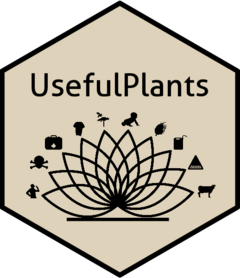

<!-- README.md is generated from README.Rmd. Please edit that file -->

# UsefulPlants 

<!-- badges: start -->
<!-- badges: end -->

`UsefulPlants` is an R package primarily developed as supporting
software for the results and analyses conducted in the article **“The
global distribution of plants used by humans”** (Pironon S. 2023). It
relies upon the R package `rsdm` (Ondo 2023) for building species
distribution models (SDMs) of plants used by humans at large scale, thus
it helps to streamline global biodiversity analyses, improve code
accessibility and reproducibility.

## *Installation*

Make sure to have [*R*](https://cloud.r-project.org/ "R") or
[*Rstudio*](https://rstudio.com/products/rstudio/download/ "Rstudio")
installed on your machine. Some R packages need to be compiled from
source, so if you are on Windows, you need to install
[*Rtools*](http://cran.r-project.org/bin/windows/Rtools/) too.

Then, install and load the package:

``` r
devtools::install_github("IanOndo/UsefulPlants") 
# optionally rebuild the vignettes by setting , build_opts = c("--no-resave-data", "--no-manual")

library(UsefulPlants)
```

Please follow the vignettes from the package
[**rsdm**](https://github.com/IanOndo/rsdm) for <u>*gathering and
curating plants occurrence records*</u> and for <u>*modelling species
distributions*</u>.

The following vignettes are available, but need to be (re-)built if
necessary.

## *Vignettes*

- Mapping species distribution, richness and endemism
- Exploring the latitudinal gradient of utilised plants species richness
  and endemism
- Exploring spatial correlations between utilised plants species
  richness/endemism and human cultural diversity (incoming soon !)

## References

<div id="refs" class="references csl-bib-body hanging-indent">

<div id="ref-rsdm" class="csl-entry">

Ondo, Ian. 2023. *<span class="nocase">rsdm</span>: A r Package for
Streamlining Large-Scale Studies of Species Distributions and
Biodiversity Patterns*. <https://github.com/IanOndo/rsdm>.

</div>

<div id="ref-UsefulPlants" class="csl-entry">

Pironon S., Ondo I., 2023. “The Global Distribution of
Plants Used by Humans.” Journal Article.

</div>

</div>
